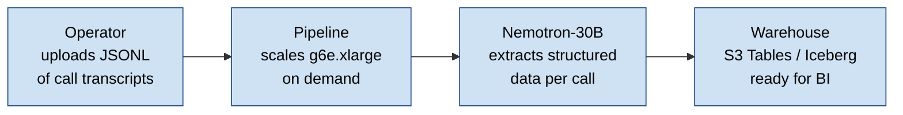

# aws-llm

**An AWS-native, auto-scaling pipeline for structured extraction from
unstructured text — \$17 to extract a 95,831-call corpus, 5.6× cheaper
than Gemini 2.5 Flash Batch, all data stays in your AWS account.**

[](LICENSE)
[](aws-llm-cost-and-readiness-brief.pdf)
[](https://huggingface.co/datasets/REPLACE-ME)

---

## TL;DR

| Metric | Value |
|---|---:|
| Cost per 95,831-call corpus  | **\$16.89** (g6e.xlarge spot) |
| Cost per call                 | **\$0.000178** |
| vs Gemini 2.5 Flash Batch     | **5.6× cheaper** |
| vs Gemini 2.5 Flash Standard  | **9× cheaper** |
| Idle cost                     | **\$0/hr** |
| Cold start                    | 3–4 minutes |
| Change propagation            | 5 minutes (cron-pulled Ansible) |
| Customer data leaves account  | **Never** |
| Throughput (warm)             | 52 calls/min |
| Per-call latency p50 / p95    | 17.3 s / 20.4 s |

> **Read the brief →** [`aws-llm-cost-and-readiness-brief.pdf`](aws-llm-cost-and-readiness-brief.pdf)
> *6 pages. Cost analysis, security argument, two-pass quality
> validation, customization recommendations.*
>
> **Dataset and frozen extractions →**
> [huggingface.co/datasets/REPLACE-ME](https://huggingface.co/datasets/REPLACE-ME)

---

## What this project is

A reproducible, end-to-end deployment of a self-hosted LLM extraction
pipeline on AWS. Operators drop call transcripts into an S3 inbox; the
system auto-scales a single GPU worker on demand, runs structured
JSON extraction with [vLLM](https://github.com/vllm-project/vllm) +
NVIDIA Nemotron-Nano-30B-A3B-FP8 on a `g6e.xlarge`, writes results
to an Apache Iceberg table in S3 Tables, and shuts itself down. Idle
cost is \$0/hr.

Built for organizations who want the cost economics of self-hosted
inference without the operational cost of always-on GPU instances,
and who can't (or won't) send customer PII to a third-party API.



---

## Why self-hosted

| Dimension | This project | Hosted API (Gemini, OpenAI) |
|---|---|---|
| **Cost** for 95k calls | **\$17** | \$94 (Batch) – \$152 (Standard) |
| **Data residency** | Stays in your AWS account, your region | Crosses to third-party processor |
| **Compliance scope** | Inherits your VPC's SOC 2 / HIPAA / PCI posture | Adds a regulated data flow you have to inventory + audit |
| **DPA / vendor risk review** | Not required | Required |
| **Air-gapped option** | Yes | No |
| **Best when** | Batch ≥750 calls + need 30B-class model quality | Realtime or sub-300-call jobs |

The dollar comparison understates the difference. Customer transcripts
contain names, addresses, DOBs, partial SSNs, payment information.
Self-hosting means **none of those bytes ever cross the boundary into
a third-party processor.**

---

## What's in this repo

```
aws-llm/
├── README.md                                 ← you are here
├── LICENSE                                   ← MIT
├── aws-llm-cost-and-readiness-brief.pdf      ← the brief (6 pages)
├── extract/                                  ← Python extraction library
│   └── extract_lib/                            (sqs_worker, iceberg_writer,
│                                               schema, client, …)
├── infra/                                    ← Terraform stacks
│   ├── bootstrap/                              (durable: S3, S3 Tables, EBS,
│   │                                           IAM, dispatcher Lambda)
│   └── runtime/                                (disposable: ASG, launch template,
│                                               SQS queues, EventBridge)
│       └── ansible/                            (worker config; cron-reconcile)
├── lambda/                                   ← AWS Lambda handlers
│   ├── dispatch/                               (SQS depth → SetDesiredCapacity)
│   └── query/                                  (Athena query wrapper)
├── test/                                     ← Go / Terratest harness
└── Makefile                                  ← task runner
```

---

## Quick start

> **Prerequisites:** AWS account with quota for one `g6e.xlarge` GPU
> instance, `terraform` ≥1.6, `python` ≥3.13, `aws` CLI configured.

### 1. Create a Terraform state bucket and edit `backend.tf`

```bash
aws s3api create-bucket --bucket your-aws-llm-tfstate --region us-east-1
aws s3api put-bucket-versioning --bucket your-aws-llm-tfstate \
    --versioning-configuration Status=Enabled

# Replace the placeholder bucket name in both backend files
sed -i.bak 's/REPLACE-ME-aws-llm-tfstate/your-aws-llm-tfstate/' \
    infra/bootstrap/backend.tf infra/runtime/backend.tf
rm infra/bootstrap/backend.tf.bak infra/runtime/backend.tf.bak
```

### 2. Apply the bootstrap stack (durable storage + IAM)

```bash
cd infra/bootstrap
terraform init
terraform apply
```

This creates the S3 artifacts bucket, S3 Tables namespace, persistent
EBS state volume, dispatcher Lambda, and IAM roles. Run once; rarely
touched after.

### 3. Apply the runtime stack (disposable scaling layer)

```bash
cd ../runtime
terraform init
terraform apply
```

ASG starts at desired-capacity 0. No GPU instance running yet.

### 4. Submit a smoke batch

```bash
make sync-code      # uploads extract_lib/ to S3
make submit FILES=test-data/smoke.jsonl.gz
make worker-status  # ASG should scale to desired=1 within ~70 seconds
make logs           # tail CloudWatch logs as the batch runs
```

The worker spins up, processes the batch, writes results to the
Iceberg table, and self-terminates back to desired=0.

### 5. Query the results

```bash
make query SQL="SELECT call_id, extraction.outcome.resolution_status \
                FROM nemo.calls_extractions \
                WHERE run_id = 'smoke-001' LIMIT 20"
```

### 6. Tear it all down

```bash
cd infra/runtime   && terraform destroy
cd ../bootstrap    && terraform destroy   # last; deletes the EBS state volume
```

---

## Architecture in one paragraph

S3 inbox bucket receives JSONL.gz files of call transcripts. An S3
event notification puts a message on an SQS queue. An EventBridge
1-minute tick fires a dispatcher Lambda, which reads SQS depth and
calls `SetDesiredCapacity` on an Auto Scaling Group of size 0–1. The
single g6e.xlarge worker boots from a 50-line Ansible-aware shim,
fetches a playbook tarball from S3, runs `vllm` in Docker against
the model weights resident on a persistent EBS state volume,
processes its assigned shards, writes Iceberg-formatted extractions
to S3 Tables, and calls
`TerminateInstanceInAutoScalingGroup(should_decrement_desired_capacity=true)`
to shut itself down atomically. A `*/5 * * * *` cron on the worker
re-pulls the playbook from S3 every five minutes for continuous
config reconcile, so prompt or schema edits propagate to a running
instance without redeployment.

The full reasoning is in
[`aws-llm-cost-and-readiness-brief.pdf`](aws-llm-cost-and-readiness-brief.pdf).

---

## Customizing for your domain

The brief's §5 ranks the customization options by cost. Short version:

| Approach | Setup cost | When it wins |
|---|---|---|
| **1. Prompt engineering + structured output** | Hours | Always start here. Covers ~70% of needs. |
| **2. RAG over policy / schema docs** | 1–2 weeks | Model needs facts it doesn't have. |
| **3. Fine-tune** (LoRA or full) | \$100–\$500 (LoRA) to \$2k–\$20k (full) + weeks | Specialized vocab that can't fit in-context. |
| **4. Distillation** *(last resort)* | Weeks–months + \$1k–\$50k | Sustained high volume where serving cost dominates. |

The structured-output approach uses Pydantic `Literal` types to anchor
enum fields to a fixed value set. From `extract/extract_lib/schema.py`:

```python
from typing import Literal
from pydantic import BaseModel, Field

class CustomerExtraction(BaseModel):
    intent_primary: Literal[
        "compare_auto_quotes",
        "purchase_auto_insurance",
        "file_claim",
        # ...
        "other",
    ] = Field(
        ...,
        description=(
            "Primary reason the customer called. "
            "Choose exactly one. Use 'other' if no value fits."
        ),
    )
```

The corresponding system-prompt addition is one sentence:
*"The intent_primary field must be one of the values listed in the
schema. Do not invent new labels."* Total cost of customization: one
PR, ten lines of code, one prompt sentence. No retraining, no labeled
data, no infrastructure change.

---

## License

MIT — see [LICENSE](LICENSE).
